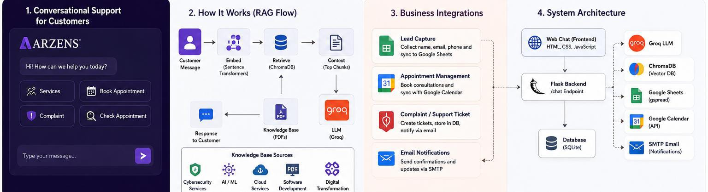

# Building a RAG-Based Customer Support System for ARZENS

### One chatbot, four jobs: answering questions, capturing leads, booking appointments, and logging complaints — all grounded in the company's own documentation

*The four pieces that make this more than a chat widget: retrieval-grounded answers, real business integrations, and a Flask backend tying them together.*

ARZENS, a cybersecurity and technology services company, deals with a mix of customer interactions that don't fit neatly into one channel: general questions about services, consultation requests, appointment scheduling, complaints, and status checks on existing appointments. Handled separately — a contact form here, a phone line there, email for complaints — these interactions lose context between each other. A customer who already explained what they need shouldn't have to repeat it three messages later just because the conversation crossed from "question" to "booking."

## The Solution

The chatbot is a RAG-based customer support system connected to ARZENS's actual business operations — not a general-purpose assistant with a company logo on it. It combines company knowledge, semantic search, a language model for generating responses, lead capture, Google Sheets, Google Calendar, a support ticket system, and email notifications, all reachable from one conversational interface.

## Conversation Flow

A customer message follows this path:

**Customer → ARZENS frontend → Flask `/chat` endpoint → Conversation management → Intent / request handling → Knowledge retrieval or operational workflow → Response → Conversation storage**

*One entry point, several possible destinations. The Conversation Manager decides whether a message needs a retrieved answer or an operational workflow — lead capture, appointment booking, a support ticket, or an appointment check.*

## RAG Architecture

The knowledge side of the system is built as a retrieval pipeline:

**ARZENS PDFs → PyMuPDF → Text extraction → Chunking with overlap → Sentence Transformers embeddings → ChromaDB → Semantic retrieval → Groq language model → Final response**

*PDFs become chunks, chunks become embeddings, and embeddings live in ChromaDB where they can be searched by meaning, not just keyword.*

PDFs from ARZENS's own material are parsed with PyMuPDF, split into overlapping text chunks so relevant information isn't cut off at an arbitrary boundary, and converted into embeddings with Sentence Transformers. Those embeddings live in ChromaDB, a vector database built for similarity search.

When a customer asks a question, the system doesn't send the question straight to the language model. It first searches ChromaDB for the chunks most semantically similar to the question, and passes those chunks to Groq's language model as context alongside the question itself. That's the core idea behind RAG: retrieval happens before generation, so the model answers from ARZENS's actual documentation instead of guessing from general training data. It's the difference between a chatbot that might sound confident and wrong, and one that's grounded in what the company actually offers.

## What Happens When a Customer Asks a Question

*Every question triggers a retrieval step before generation — the retriever searches ChromaDB for relevant chunks, and only then does Groq generate a response.*

## Lead Capture

When a conversation naturally produces contact information — a name, email, or mobile number — the chatbot captures it and stores it in the application database, then syncs it to Google Sheets. This is a separate mechanism from any outbound prospecting workflow; there's no shared code or data path with a scraping pipeline. Here, leads come from customers who are already talking to ARZENS, not from outbound research.

## Appointment Management

For consultation requests, the chatbot collects the relevant details through conversation, creates the corresponding event through the Google Calendar integration, records it in the database, and optionally syncs it to Google Sheets for visibility outside the calendar itself.

## Complaint and Ticket System

Complaints are converted into structured support tickets rather than left as unstructured chat logs. A ticket can include customer information, the complaint itself, a priority level, status, expected resolution timeframe, an assigned representative, and a summary of the relevant conversation. Tickets are stored in the database, mirrored to Google Sheets, and trigger an email notification so a complaint doesn't sit unnoticed in a chat history.

## How the Different Flows Fit Together

*Three distinct operational flows, each ending in the same place: database, Google Sheets, and — where relevant — an email notification.*

## Technology Stack

- **Flask** — the web framework handling the `/chat` endpoint and routing
- **Flask-SQLAlchemy / SQLite** — application data storage
- **Groq** — language model inference for generating responses
- **Sentence Transformers** — embedding generation for semantic search
- **ChromaDB** — vector storage and similarity retrieval
- **PyMuPDF** — PDF text extraction for the knowledge base
- **Google Sheets API / gspread** — syncing leads, appointments, and tickets to spreadsheets
- **Google Calendar API** — appointment scheduling
- **SMTP** — email notifications for tickets and confirmations
- **HTML / CSS / JavaScript** — the customer-facing frontend

## Knowledge Base Design

The knowledge base is built from ARZENS's own material and covers the company's actual service areas: cybersecurity, penetration testing, red teaming, digital forensics and incident response, IT and security consulting, AI and machine learning, software development, web and mobile development, cloud services, UI/UX, and digital transformation.

Grounding retrieval in this material specifically — rather than letting the model answer from general knowledge — reduces the chance of the chatbot inventing services ARZENS doesn't offer or giving generic answers that don't reflect the company's actual positioning.

## Conversation Management

Each conversation is tracked with a conversation ID, its message history, the detected intent, its current state, any customer data already collected, and a running summary. This is what lets the chatbot handle multi-step interactions without repeatedly asking a customer for information they already provided — if someone gave their email two messages ago while asking about pricing, the system doesn't ask again when they move on to booking a consultation.

## Challenges

**Keeping answers grounded.** The main risk with any RAG system is retrieval returning weak or irrelevant chunks, which can lead the language model to fill gaps with unsupported information. Chunking strategy and overlap size were tuned to reduce this.

**Multi-step conversations.** A single customer interaction can move between asking a question, providing contact info, and requesting an appointment. The conversation state model exists specifically to hold that context.

**Connecting chat to real operations.** It's one thing to answer a question. It's another to reliably turn a conversation into a calendar event or a ticket without losing information in the handoff between the chat layer and the operational integrations.

**Keeping integrations separated.** Google Sheets, Google Calendar, and email notifications each serve a different part of the workflow, and were built to fail independently — a calendar API hiccup shouldn't take down ticket creation.

**Missing knowledge.** When a customer asks something outside what the knowledge base covers, the system needs to handle that gracefully rather than fabricate an answer.

## Business Impact

The chatbot gives ARZENS a single customer-facing interface for answering common questions, capturing potential leads, handling appointment requests, and collecting complaints as structured data instead of scattered messages across different channels.

## Future Improvements

- **Better retrieval and reranking**, to improve which chunks get surfaced for ambiguous questions.
- **A larger knowledge base**, as ARZENS produces more documentation to draw from.
- **PostgreSQL for production workloads**, since SQLite is a reasonable starting point but not built for concurrent production traffic at scale.
- **CRM integration**, so captured leads and tickets flow into the same system the sales and support teams already use.
- **An analytics dashboard**, to track common questions, conversation outcomes, and ticket volume over time.
- **Human-agent handoff**, for conversations that need a person rather than a bot.
- **Multilingual support**, given the customer base isn't limited to English speakers.

## Our Approach at Galvan AI

We built this the way we build most systems at Galvan AI: start with the actual business problem, define the workflow the way it currently happens, connect the services that need to talk to each other, keep integrations isolated enough that one failing doesn't take the rest down, and leave room for the system to grow past its first version.

This didn't start as "let's build a RAG chatbot." It started as customer questions, leads, appointments, and complaints living in disconnected places, and the technical decisions followed from there.

## What's Next

CRM integration is the most immediate next step — it's the piece that would connect captured leads and tickets to the tools the support and sales teams already use every day.

---

**Galvan AI**
Website: [galvanai.com](https://www.galvanai.com/)
LinkedIn: [pk.linkedin.com/company/galvanai](https://pk.linkedin.com/company/galvanai)
Instagram: [@galvan_ai](https://www.instagram.com/galvan_ai/)
YouTube: [@GalvanAi](https://www.youtube.com/@GalvanAi)
