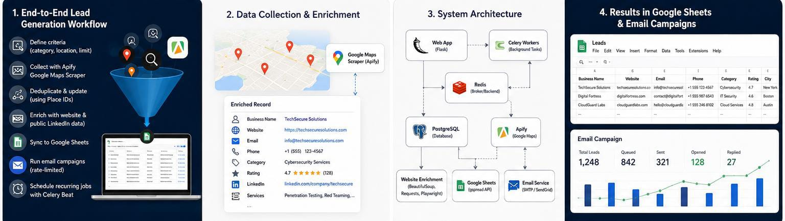
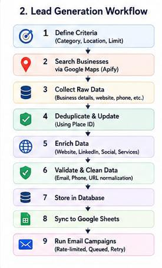
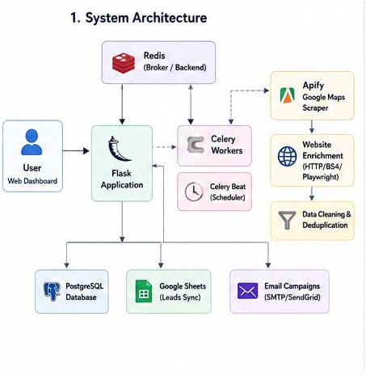
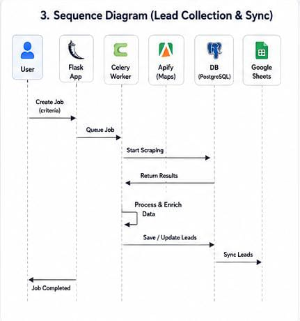
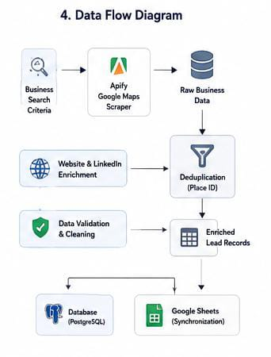

# From Business Discovery to Enriched Prospect Records: Building a Lead Generation Automation System

### How we turned a manual, tab-by-tab prospecting process into a pipeline that runs on its own

  

*The full loop: define criteria once, and the system handles collection, enrichment, sync, and outreach.*

Finding a business is easy. Turning that business into a clean, usable prospect record is not.

Before this system existed, building a lead list meant searching a directory or Google Maps for a category and location, opening each result in its own tab, checking for a website, digging through it for a contact page, copying down whatever email or phone number was there, maybe checking if the business had a LinkedIn page, and then pasting all of it into a spreadsheet — while also checking that you hadn't already added the same business twice.

None of these steps is difficult by itself. The problem shows up at volume. Fifty businesses is tedious but doable. Five hundred is not something anyone should be doing by hand, and the error rate — duplicates, missed contact info, inconsistent formatting — climbs as the list grows instead of staying flat.

## The Idea

The system needed three inputs from a user: business category, location, and a maximum number of results. Everything after that — collection, enrichment, cleanup, storage, and getting the data somewhere the sales team could actually use — needed to happen without anyone babysitting it.

## How We Approached It

The system is built as a pipeline, not a single script, because each stage has a different failure mode and a different amount of latency:

**Business criteria → Apify Google Maps collection → Duplicate handling → Website enrichment → Public LinkedIn enrichment where available → Data cleaning → Database storage → Google Sheets synchronization → Email campaign**

  

*Nine steps, one trigger. The user only touches step one.*

## System Architecture

The Flask app is the only part of the system a user directly interacts with. Everything downstream of it runs in the background.

  

*Flask hands off jobs to Celery through Redis. Apify does the collecting, the enrichment layer fills in the gaps, and cleaned data flows to PostgreSQL, Google Sheets, and email campaigns.*

## Collection Layer

Raw business data comes from the Apify Google Maps Scraper. For each result, Apify can return the business name, category, website, phone number, address, city, country, Google Maps URL, rating, review count, coordinates, opening hours, business status, and — when available — a place ID.

The place ID matters more than it sounds like it should. Business names get formatted inconsistently across sources — "Al Noor Traders" versus "Al-Noor Traders" versus "AL NOOR TRADERS LLC" — which makes name-based duplicate detection unreliable. A place ID is a stable identifier tied to the physical location, so matching on it catches duplicates that string comparison would miss.

## Enrichment Layer

A Google Maps listing gets you a business's existence and rough contact info. It rarely gets you an email address. That's what the enrichment layer is for — it visits the business's website, when one exists, and checks the homepage, contact page, about page, and team page for anything usable: email addresses, phone numbers, WhatsApp numbers, fax numbers, social links, a company description, or a services list.

Not every site cooperates. Some render contact information with JavaScript, which a plain HTTP request won't see. For those, the pipeline falls back to Playwright, which actually loads the page the way a browser would before extracting content.

LinkedIn enrichment is deliberately limited to what's publicly visible on a company or profile page. There's no login, no session hijacking, no bypassing of LinkedIn's access controls — it's a best-effort bonus data point, not a core dependency.

## Data Quality

Enrichment produces messy data by nature, since it's pulled from dozens of differently structured websites. Before anything reaches storage, records go through:

- URL normalization, so `example.com`, `www.example.com`, and `https://example.com/` are treated as the same site
- Email format validation
- Phone number normalization to a consistent format
- Duplicate prevention using place ID matching plus secondary checks
- Explicit handling for missing fields, instead of blanks that break formatting downstream

None of it is glamorous, but it's the difference between a usable lead list and a spreadsheet someone has to clean up by hand anyway.

## Background Processing

Scraping and enrichment are slow. Visiting hundreds of websites, checking multiple pages on each, is not something that belongs inside a web request — the user would be staring at a spinner for minutes.

That's why the heavy work runs through Celery, with Redis as the message broker. A user kicks off a job from the Flask interface, the job gets queued, and Celery workers process it in the background. Celery Beat handles scheduled and recurring scraping jobs, so a category and location can be set to run on a cron schedule without anyone triggering it manually each time.

## How a Job Actually Moves Through the System

  

*A user submits criteria once. Flask queues the job, Celery does the work, and the results land in the database and Google Sheets without the user waiting on any of it.*

## From Raw Records to Enriched Leads

  

*Raw scraped data goes through deduplication and validation before it's allowed to become a stored, synced lead record.*

## Google Sheets Integration

Once records are cleaned and stored, they're synchronized to Google Sheets — the tool the sales team was already using day to day. The integration creates a worksheet if one doesn't exist, sets up consistent column headers, and appends new lead records without duplicating rows that are already there. Nothing exotic, but it's the piece that makes the automation actually reach the people who need the data, instead of leaving it sitting in a database only engineers can query.

## Email Campaigns

From the enriched lead list, the system supports selecting a subset of leads, creating a campaign, and queueing emails with rate limiting so sending doesn't trip spam filters or hit provider limits. Temporary failures — a bounced connection, a rate-limit response — get retried. This isn't a guarantee of delivery or open rates; it's infrastructure for sending outreach at a pace that doesn't get the sender's domain flagged.

## Challenges

**Inconsistent website structures.** There's no standard layout for a "contact us" page, so enrichment logic has to check multiple page types and content patterns instead of relying on one selector.

**JavaScript-rendered content.** A meaningful share of business websites won't expose contact info to a plain HTTP GET request. Playwright fixes this but adds latency, so it's used selectively rather than for every site.

**Duplicate businesses across searches.** The same business can appear across multiple category or location searches. Place ID matching handles most of it, with name/address matching as a secondary check.

**Unreliable public information.** Not every business has current, accurate contact info listed anywhere online. The system stores partial records rather than failing on missing fields.

**External service limits.** Both Apify and email providers have rate limits and usage costs, which shaped how aggressively the pipeline scrapes and sends.

## Business Impact

What used to be a multi-step manual research process — searching, opening tabs, copying data, checking for duplicates, updating a spreadsheet — is now a workflow where someone defines search criteria once and the system handles collection, enrichment, storage, synchronization, and campaign preparation on its own.

## Future Improvements

- **CRM integration**, so leads flow directly into whatever sales pipeline tool the team already uses, instead of living in a spreadsheet as an intermediate step.
- **Lead scoring**, to help prioritize outreach when a search returns more leads than the team can contact at once.
- **Deeper enrichment sources**, to increase the percentage of leads with a usable email address.
- **Campaign analytics**, so open and response rates actually inform which lead segments are worth pursuing.
- **More advanced sequencing**, for multi-touch outreach instead of a single email per lead.
- **Larger-scale processing**, for searches that return results in the thousands rather than hundreds.

## Our Approach at Galvan AI

We built this the way we build most automation systems at Galvan AI: start with the actual manual process, define the workflow the way a person currently does it, connect the services that need to talk to each other, automate the repetitive steps, store data in a structured form, push slow work off the main request path, and keep integrations isolated enough that one failing doesn't take the rest down with it.

This system didn't start as "let's build a scraper." It started as someone doing too much manual work, and the technical decisions followed from there.

## What's Next

CRM integration is the most immediate next step — it's the piece that would connect what's already automated to the tool the sales team uses every day, closing the last manual gap in the workflow.

---

**Galvan AI**
Website: [galvanai.com](https://www.galvanai.com/)

LinkedIn: [pk.linkedin.com/company/galvanai](https://pk.linkedin.com/company/galvanai)

Instagram: [@galvan_ai](https://www.instagram.com/galvan_ai/)

YouTube: [@GalvanAi](https://www.youtube.com/@GalvanAi)
